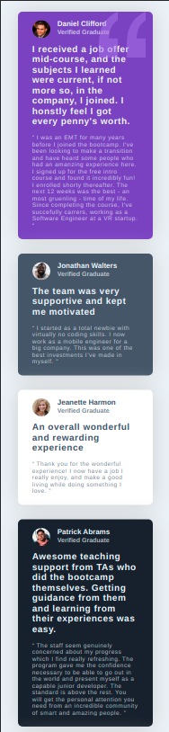

# Testimonials grid section

This is a solution to the <strong> <a href="https://www.frontendmentor.io/challenges/testimonials-grid-section-Nnw6J7Un7">Testimonials grid section</a> </strong> 

Frontend Mentor challenges help you improve your coding skills by building realistic projects.

### Overview
Challenge to train skills with CSS grid

### The challenge
The challenge is to build a testimonial grid section and make it look as close to the design as possible.

### Screenshot

### Links

 - Solution URL: https://www.frontendmentor.io/solutions/bootcamp-testimonials-grid-section-with-css-grid-K4vcXVqLH
 - Live site URL: https://claudioalvesmachado.github.io/testimonials-grid/
 

### Build with:

 - HTML5
 - CSS3
 - Flexbox
 - CSS Grid
 - Mobile first workflow
 
 

## Social

 - https://github.com/claudioalvesmachado
 - https://www.linkedin.com/in/mlvgns

